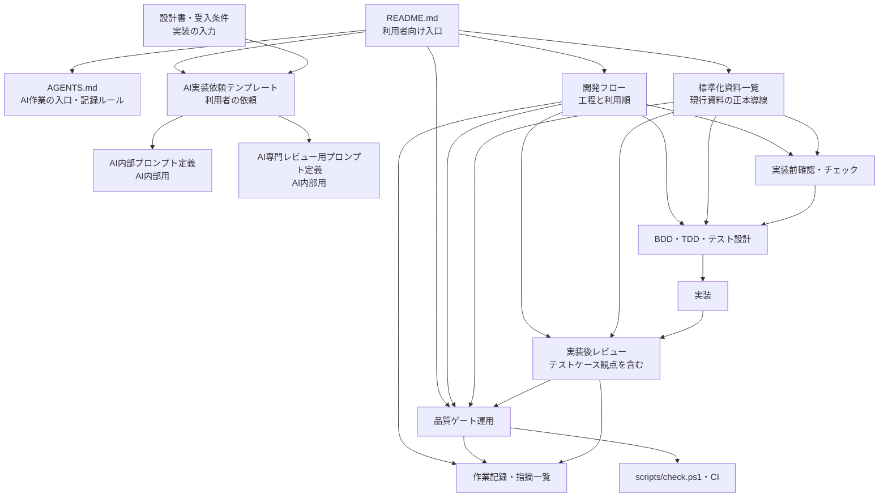

# ProjectFoundation

日報の登録・編集・一覧を扱うアプリケーションと、AIを利用した開発手順を管理するリポジトリです。

## 現行構成

- フロントエンド: React / Vite / TypeScript
- バックエンド: Spring Boot / Java 21
- データベース: Oracle Database

## 最初に読む資料

目的に応じて、次の順に確認してください。

| 目的 | 最初に読む資料 | 役割 |
| --- | --- | --- |
| 資料全体を探す | [標準化資料一覧](docs/AI活用開発研究/構想メモ/標準化/標準化資料一覧.md) | 現行の開発標準資料と用途の一覧 |
| 開発の流れを確認する | [開発フロー](docs/AI活用開発研究/構想メモ/標準化/開発フロー.md) | IntakeからRecordまでの標準手順 |
| AIに実装を依頼する | [AI実装依頼テンプレート](docs/AI活用開発研究/構想メモ/標準化/AI実装依頼テンプレート.md) | 利用者が入力する実装依頼の入口 |
| AIに作業させる | [AGENTS.md](AGENTS.md) | AI作業時の入口、記録、資料確認のルール |
| 品質ゲートを確認する | [品質ゲート運用](docs/AI活用開発研究/構想メモ/標準化/品質ゲート運用.md) | LocalとCIのチェック内容、実行方法、判定基準 |

## 利用方法

### AIに機能実装を依頼する場合

AIを使った機能追加・修正も、通常の機能開発で必要な設計、テスト、レビュー、品質確認の流れに沿って進めます。

1. [AI実装依頼テンプレート](docs/AI活用開発研究/構想メモ/標準化/AI実装依頼テンプレート.md)に、目的、仕様、受入条件、制約、対象外を記入する。
2. 対象機能の設計書と受入条件を確認し、[実装前チェック表](docs/AI活用開発研究/構想メモ/標準化/実装前チェック表.md)と[実装前確認観点](docs/AI活用開発研究/構想メモ/標準化/実装前確認観点.md)で不明点や仕様の不足を解消する。
3. 必要に応じて[セキュリティ規約](docs/AI活用開発研究/構想メモ/標準化/セキュリティ規約.md)、[ディレクトリ構成ルール](docs/AI活用開発研究/構想メモ/標準化/ディレクトリ構成ルール.md)、[共通部品化判断基準](docs/AI活用開発研究/構想メモ/標準化/共通部品化判断基準.md)を確認する。
4. BDDシナリオとテストケースを作成し、[テストケースレビュー観点](docs/AI活用開発研究/構想メモ/標準化/テストケースレビュー観点.md)を使って要求・受入条件との対応、境界値・異常系・状態遷移、期待結果の妥当性を確認してから承認する。
5. 承認したケースから単体テストを作成する。
6. 承認した仕様とテストに基づいて実装する。
7. [実装後レビュー表](docs/AI活用開発研究/構想メモ/標準化/実装後レビュー表.md)と[実装後レビュー観点](docs/AI活用開発研究/構想メモ/標準化/実装後レビュー観点.md)でAIの自己レビューと専門観点レビューを実施し、指摘を修正または保留判断する。レビューで得られた再発防止に有効な指摘は、個別ケースだけでなく標準の観点へ反映するか検討する。
8. [テスト・静的解析チェック表](docs/AI活用開発研究/構想メモ/標準化/テスト・静的解析チェック表.md)と[品質ゲート運用](docs/AI活用開発研究/構想メモ/標準化/品質ゲート運用.md)に従って検証し、結果を作業記録へ残します。

AIを使わずに実装する場合も、2〜8の実装前確認、テスト設計、レビュー、品質ゲート、記録の流れを適用します。AI内部の実行順序は[AI内部プロンプト定義](docs/AI活用開発研究/構想メモ/標準化/AI内部プロンプト定義.md)、専門観点レビューの定義は[AI専門レビュー用プロンプト定義](docs/AI活用開発研究/構想メモ/標準化/AI専門レビュー用プロンプト定義.md)で管理します。これらは通常、利用者が直接編集・実行する資料ではありません。

### 品質チェックを実行する場合

品質ゲートの詳細と前提バージョンは[品質ゲート運用](docs/AI活用開発研究/構想メモ/標準化/品質ゲート運用.md)を正本とします。Modeごとの違いは次のとおりです。

| Mode | 主な用途 | 主な確認範囲 | Oracle接続 |
| --- | --- | --- | --- |
| `PrePush` | push前の差分チェック | push対象差分の空白、生成物、secret、Frontend lint、Markdown lint、Java変更時Spotless | なし |
| `Quick` | コミット前の短時間チェック | staged対象の空白、生成物、secret、Frontend lint、Markdown lint、Java変更時のSpotless | なし |
| `Full` | ローカルでの総合チェック | Frontend lint・typecheck・unit・build、Backend test-compile・Spotless・Checkstyle・SpotBugs | なし |
| `Oracle` | DB接続を含む統合チェック | 接続先の安全確認、通常テスト、`*IT` | あり |
| `All` | FullとOracleをまとめて確認 | Full完了後にOracleも実行し、両方の結果を集約 | あり |

`PrePush`はpush対象差分を検査します。`Quick`はGit indexから対象ファイル名を取得するため、確認対象をstageしてから実行します。作業ツリーの内容を検査するため、stage後の変更も検査対象になります。`Full`にはOracle接続、E2E、coverageは含まれず、E2Eやcoverageは別のCI taskとして実行します。Oracle接続を使うModeは、接続先と資格情報の安全条件を満たす環境でのみ実行してください。

実行前に固定バージョンや依存環境を確認する場合は`doctor`を実行します。代表的な実行例は次のとおりです。

```powershell
pwsh -NoProfile -File scripts/doctor.ps1
pwsh -NoProfile -File scripts/check.ps1 -Mode Quick
pwsh -NoProfile -File scripts/check.ps1 -Mode Full
pwsh -NoProfile -File scripts/check.ps1 -Mode Oracle
pwsh -NoProfile -File scripts/check.ps1 -Mode All
```

変更内容と検証結果は、[作業記録](docs/AI活用開発研究/作業記録/)に残します。レビュー指摘は[指摘一覧](docs/AI活用開発研究/作業記録/日報登録編集_指摘一覧.md)にも反映します。

## 資料の関係

資料は、利用者向けの入口、AI内部の実行定義、開発標準、品質ゲート、記録に分かれます。主な関係は次のとおりです。



## AI利用時の基本注意

- 機密情報、個人情報、認証情報、許可のない未公開情報をAIへ入力しない。
- 仕様、設計、テストケース、期待結果、生成コードの採用判断は人が行う。
- 仕様にない動作や不明点をAIが推測して実装した場合は採用せず、確認してから進める。
- ファイル名、API、ライブラリの仕様、DB項目、テスト結果は実際のリポジトリや公式情報で確認する。
- AIのレビュー回数や生成テスト数を品質の証拠とはせず、指摘と判断を記録する。

## 資料の利用区分

新規作業の入口と、記録・研究目的の資料を区別しています。

- 現行の作業入口: README、AGENTS.md、標準化資料一覧、開発フロー、AI実装依頼テンプレート。
- AI内部用: AI内部プロンプト定義、AI専門レビュー用プロンプト定義、標準化資料内のAI用スキル。通常の利用者は直接編集しない。
- 作業時に参照する標準: 実装前・レビュー・テスト・品質ゲート関連の資料。詳細は標準化資料一覧を確認する。
- 記録・研究用: 作業記録、検証記録、構想メモ。新規作業の入口ではなく、判断履歴や再利用可能な知見を確認するために使う。
- 退避済みの旧資料: `docs/AI活用開発研究/構想メモ/標準化/旧資料/`。現行資料と重複するため、新規作業では参照しない。

今回、独立していた`docs/AI活用開発研究/構想メモ/標準化/AI利用ルール・注意事項.md`は削除し、利用上の基本注意をこのREADME、AGENTS.md、AI実装依頼テンプレートに統合しました。
