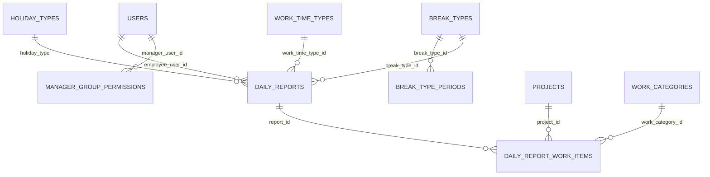

# 日報管理システム 基本設計書：DB定義

## 文書情報

| 項目 | 内容 |
| --- | --- |
| 文書種別 | 基本設計書 |
| 対象 | 日報管理システム |
| 版数 | 1.0 |
| 作成日 | 2026-07-25 |
| DBMS | Oracle Database |
| 設計基準 | 現行Entity・Oracleスキーマ定義・業務設計に準拠 |
| DDL本文 | 本書には掲載しない。実装DDLは「実装資料との対応」を参照する |

## 1. 目的

日報管理システムで使用するデータベースの物理構成、テーブル、列、キー、制約、索引、状態整合性、マスタ値を定義する。

本書を、DBに関する正式な基本設計の正本とする。DBスキーマを変更する場合は、実装DDLだけでなく本書の定義も更新する。

## 2. 対象範囲

### 2.1 対象

- ログイン利用者とロール
- 案件、作業分類、休日区分、休憩区分、勤務区分
- 日報ヘッダと作業明細
- 上長の承認対象グループ権限
- 日報の提出、承認、差戻し、再提出に必要な監査情報

### 2.2 対象外

- マスタメンテナンス画面
- グループを独立したマスタテーブルとして管理する機能
- 差戻し履歴の履歴テーブル化
- 論理削除
- DDL、データ移行SQL、運用ジョブの本文

## 3. 参照資料

| 資料 | 用途 |
| --- | --- |
| `DB概念設計.md` | 概念モデル、業務上のエンティティ、設計方針 |
| `機能一覧・受入条件.md` | DB整合性に関わる受入条件 |
| `API一覧.md` | API入出力と永続化項目の対応 |
| `状態遷移・業務フロー設計.md` | 承認状態と監査項目の更新規則 |
| `入力チェック・業務ルール一覧.md` | DB制約だけでは表現しない業務ルール |
| `../../../backend/src/main/resources/db/oracle/schema-login.sql` | 現行の初期スキーマ定義 |
| `../../../backend/src/main/resources/db/oracle/schema-daily-report.sql` | 現行の日報関連スキーマ定義 |
| `../../../backend/src/main/resources/db/oracle/schema-daily-report-approval.sql` | 既存スキーマへの承認監査項目追加 |
| `../../../backend/src/main/resources/db/oracle/seed-master-data.sql` | 初期マスタデータ |

## 4. DB設計方針

- Oracle Databaseを使用する。
- 文字列は現行DDLに合わせて `VARCHAR2(n CHAR)` を使用し、長さは文字数で定義する。
- 時間量と時刻は分単位の整数で保持する。時刻の `0` は00:00、`1439` は23:59を表す。
- 業務日時は `TIMESTAMP` または `TIMESTAMP WITH LOCAL TIME ZONE` を使用する。承認・提出・差戻し日時はタイムゾーンを考慮できる型を使用する。
- 日報には、登録時点の社員名、グループ名、休憩区分名、勤務区分名を保持する。マスタ変更後も過去の日報表示・CSV出力を維持するためである。
- 論理削除は行わず、マスタの利用可否は `enabled` で管理する。
- 真偽値を表すフラグは `NUMBER(1)` とし、`1` を有効、`0` を無効とする。
- 承認状態とロールは、定義済みのコード値だけを使用する。
- 同一社員・同一日の日報は1件だけ登録できる。
- 日報ヘッダと作業明細の更新は、1回の日報保存処理として整合性を保つ。

## 5. ER概要

現行の物理DBでは、グループを独立テーブルとして作成せず、`users` と `daily_reports` にグループID・グループ名を保持する。`manager_group_permissions.group_id` もこのグループIDを参照するが、現行DDL上の外部キーは設定していない。

## 6. テーブル一覧

| No | テーブル | 論理名 | 主な用途 |
| --- | --- | --- | --- |
| 1 | `users` | 利用者 | ログイン、ロール、社員・グループ情報 |
| 2 | `projects` | 案件 | 作業明細の案件選択、集計 |
| 3 | `work_categories` | 作業分類 | 作業明細の分類選択、集計 |
| 4 | `holiday_types` | 休日区分 | 勤務時間・作業明細の入力可否 |
| 5 | `break_types` | 休憩区分 | 休憩時間の自動算出 |
| 6 | `break_type_periods` | 休憩時間帯 | 休憩区分ごとの時間帯 |
| 7 | `work_time_types` | 勤務区分 | 通常・残業・深夜時間の算出 |
| 8 | `daily_reports` | 日報ヘッダ | 日付、勤務時間、承認状態、監査情報 |
| 9 | `daily_report_work_items` | 日報作業明細 | 案件・作業分類別の作業時間 |
| 10 | `manager_group_permissions` | 上長グループ権限 | 上長が承認できるグループ |

## 7. テーブル定義

凡例: 「NULL可」が「不可」の列は `NOT NULL`、「キー」が空欄の列は非キー列を表す。

### 7.1 users（利用者）

| 論理名 | 物理名 | 型 | NULL可 | キー・初期値 | 説明 |
| --- | --- | --- | --- | --- | --- |
| ユーザーID | `user_id` | `VARCHAR2(20 CHAR)` | 不可 | PK | システム内部の利用者識別子 |
| 社員ID | `employee_id` | `VARCHAR2(20 CHAR)` | 不可 | UNIQUE | 業務上の社員識別子 |
| ログインID | `login_id` | `VARCHAR2(80 CHAR)` | 不可 | UNIQUE | ログインに使用する識別子 |
| パスワードハッシュ | `password_hash` | `VARCHAR2(100 CHAR)` | 不可 | | BCrypt等でハッシュ化した値。平文は保持しない |
| 利用者名 | `user_name` | `VARCHAR2(120 CHAR)` | 不可 | | 画面表示、日報登録時のスナップショット元 |
| ロール | `user_role` | `VARCHAR2(20 CHAR)` | 不可 | CHECK | `EMPLOYEE`、`MANAGER`、`ADMIN` |
| グループID | `group_id` | `VARCHAR2(20 CHAR)` | 可 | | 社員の所属グループID |
| グループ名 | `group_name` | `VARCHAR2(120 CHAR)` | 可 | | 所属グループ名のスナップショット |
| 休憩区分ID | `break_type_id` | `VARCHAR2(20 CHAR)` | 可 | | 社員に設定された休憩区分 |
| 休憩区分名 | `break_type_name` | `VARCHAR2(120 CHAR)` | 可 | | 休憩区分名のスナップショット |
| 勤務区分ID | `work_time_type_id` | `VARCHAR2(20 CHAR)` | 可 | | 社員に設定された勤務区分 |
| 勤務区分名 | `work_time_type_name` | `VARCHAR2(120 CHAR)` | 可 | | 勤務区分名のスナップショット |
| 作成日時 | `created_at` | `TIMESTAMP` | 不可 | `SYSTIMESTAMP` | 利用者作成日時 |
| 更新日時 | `updated_at` | `TIMESTAMP` | 不可 | `SYSTIMESTAMP` | 利用者更新日時 |

主な制約:

- `user_id` を主キーとする。
- `employee_id` と `login_id` は一意とする。
- `user_role` は `EMPLOYEE`、`MANAGER`、`ADMIN` のいずれかとする。
- ロールごとのグループ・休憩区分・勤務区分の必須性はアプリケーションの入力・初期データ処理で検証する。

### 7.2 projects（案件）

| 論理名 | 物理名 | 型 | NULL可 | キー・初期値 | 説明 |
| --- | --- | --- | --- | --- | --- |
| 案件ID | `project_id` | `VARCHAR2(20 CHAR)` | 不可 | PK | 案件識別子 |
| 案件名 | `project_name` | `VARCHAR2(120 CHAR)` | 不可 | | 画面表示、CSV出力に使用 |
| 表示順 | `display_order` | `NUMBER(5)` | 不可 | | 選択肢の表示順 |
| 有効フラグ | `enabled` | `NUMBER(1)` | 不可 | `1` | `1`:有効、`0`:無効 |

### 7.3 work_categories（作業分類）

| 論理名 | 物理名 | 型 | NULL可 | キー・初期値 | 説明 |
| --- | --- | --- | --- | --- | --- |
| 作業分類ID | `work_category_id` | `VARCHAR2(20 CHAR)` | 不可 | PK | 作業分類識別子 |
| 作業分類名 | `work_category_name` | `VARCHAR2(120 CHAR)` | 不可 | | 画面表示、CSV出力に使用 |
| 表示順 | `display_order` | `NUMBER(5)` | 不可 | | 選択肢の表示順 |
| 有効フラグ | `enabled` | `NUMBER(1)` | 不可 | `1` | `1`:有効、`0`:無効 |

### 7.4 holiday_types（休日区分）

| 論理名 | 物理名 | 型 | NULL可 | キー・初期値 | 説明 |
| --- | --- | --- | --- | --- | --- |
| 休日区分コード | `holiday_type` | `VARCHAR2(20 CHAR)` | 不可 | PK | 休日区分を識別するコード |
| 休日区分名 | `holiday_type_name` | `VARCHAR2(120 CHAR)` | 不可 | | 画面表示、CSV出力に使用 |
| 勤務時刻必須フラグ | `requires_work_time` | `NUMBER(1)` | 不可 | | 勤務開始時刻・勤務終了時刻の要否 |
| 作業明細許可フラグ | `allows_work_items` | `NUMBER(1)` | 不可 | | 作業明細登録の可否 |
| 表示順 | `display_order` | `NUMBER(5)` | 不可 | | 選択肢の表示順 |
| 有効フラグ | `enabled` | `NUMBER(1)` | 不可 | `1` | 1:有効、0:無効 |

### 7.5 break_types（休憩区分）

| 論理名 | 物理名 | 型 | NULL可 | キー・初期値 | 説明 |
| --- | --- | --- | --- | --- | --- |
| 休憩区分ID | `break_type_id` | `VARCHAR2(20 CHAR)` | 不可 | PK | 休憩区分識別子 |
| 休憩区分名 | `break_type_name` | `VARCHAR2(120 CHAR)` | 不可 | | 画面表示に使用 |
| 表示順 | `display_order` | `NUMBER(5)` | 不可 | | 選択肢の表示順 |
| 有効フラグ | `enabled` | `NUMBER(1)` | 不可 | `1` | 1:有効、0:無効 |

### 7.6 break_type_periods（休憩時間帯）

| 論理名 | 物理名 | 型 | NULL可 | キー・初期値 | 説明 |
| --- | --- | --- | --- | --- | --- |
| 休憩区分ID | `break_type_id` | `VARCHAR2(20 CHAR)` | 不可 | FK | `break_types.break_type_id` |
| 開始分 | `start_minutes` | `NUMBER(4)` | 不可 | | 0:00からの経過分 |
| 終了分 | `end_minutes` | `NUMBER(4)` | 不可 | | 0:00からの経過分 |
| 表示順 | `display_order` | `NUMBER(5)` | 不可 | | 同一休憩区分内の順序 |

主な制約・識別単位:

- `break_type_id` は `break_types.break_type_id` を参照する。
- 現行DDLでは独立した主キー制約を定義していない。
- 業務上の識別単位は `break_type_id` と `display_order` の組み合わせとする。主キー制約の追加は本作業の対象外とし、マスタメンテナンス導入時に再確認する。
- `end_minutes` は `start_minutes` より後でなければならない。この検証は現行では初期データ・アプリケーションで行う。

### 7.7 work_time_types（勤務区分）

| 論理名 | 物理名 | 型 | NULL可 | キー・初期値 | 説明 |
| --- | --- | --- | --- | --- | --- |
| 勤務区分ID | `work_time_type_id` | `VARCHAR2(20 CHAR)` | 不可 | PK | 勤務区分識別子 |
| 勤務区分名 | `work_time_type_name` | `VARCHAR2(120 CHAR)` | 不可 | | 画面表示に使用 |
| 通常勤務開始時刻（分） | `regular_start_minutes` | `NUMBER(4)` | 不可 | | 通常勤務帯の開始分 |
| 通常勤務終了時刻（分） | `regular_end_minutes` | `NUMBER(4)` | 不可 | | 通常勤務帯の終了分 |
| 深夜勤務開始時刻（分） | `night_start_minutes` | `NUMBER(4)` | 不可 | | 深夜勤務帯の開始分 |
| 深夜勤務終了時刻（分） | `night_end_minutes` | `NUMBER(4)` | 不可 | | 深夜勤務帯の終了分 |
| 表示順 | `display_order` | `NUMBER(5)` | 不可 | | 選択肢の表示順 |
| 有効フラグ | `enabled` | `NUMBER(1)` | 不可 | `1` | 1:有効、0:無効 |

### 7.8 daily_reports（日報ヘッダ）

| 論理名 | 物理名 | 型 | NULL可 | キー・初期値 | 説明 |
| --- | --- | --- | --- | --- | --- |
| 日報ID | `report_id` | `VARCHAR2(40 CHAR)` | 不可 | PK | 日報識別子 |
| 社員ユーザーID | `employee_user_id` | `VARCHAR2(20 CHAR)` | 不可 | FK | `users.user_id`。日報の所有者 |
| 社員ID | `employee_id` | `VARCHAR2(20 CHAR)` | 不可 | | 登録時点の社員IDスナップショット |
| 社員名 | `employee_name` | `VARCHAR2(120 CHAR)` | 不可 | | 登録時点の社員名スナップショット |
| グループID | `group_id` | `VARCHAR2(20 CHAR)` | 不可 | | 登録時点の所属グループID |
| グループ名 | `group_name` | `VARCHAR2(120 CHAR)` | 不可 | | 登録時点の所属グループ名 |
| 日報日 | `report_date` | `DATE` | 不可 | UNIQUEの構成列 | 社員ごとの日報対象日 |
| 休日区分 | `holiday_type` | `VARCHAR2(20 CHAR)` | 不可 | FK | `holiday_types.holiday_type` |
| 休憩区分ID | `break_type_id` | `VARCHAR2(20 CHAR)` | 可 | FK | 登録時に使用した休憩区分 |
| 休憩区分名 | `break_type_name` | `VARCHAR2(120 CHAR)` | 可 | | 登録時点の休憩区分名 |
| 勤務区分ID | `work_time_type_id` | `VARCHAR2(20 CHAR)` | 可 | FK | 登録時に使用した勤務区分 |
| 勤務区分名 | `work_time_type_name` | `VARCHAR2(120 CHAR)` | 可 | | 登録時点の勤務区分名 |
| 勤務開始時刻（分） | `start_time_minutes` | `NUMBER(4)` | 可 | | 0:00からの経過分 |
| 勤務終了時刻（分） | `end_time_minutes` | `NUMBER(4)` | 可 | | 0:00からの経過分 |
| 休憩時間分 | `break_minutes` | `NUMBER(5)` | 可 | | 休憩区分から算出した休憩時間 |
| 実勤務時間分 | `work_minutes` | `NUMBER(5)` | 可 | | 勤務時間から休憩時間を差し引いた時間 |
| 通常勤務時間分 | `regular_work_minutes` | `NUMBER(5)` | 可 | | 通常勤務帯に該当する時間 |
| 残業時間分 | `overtime_work_minutes` | `NUMBER(5)` | 可 | | 通常勤務帯外の時間 |
| 深夜勤務時間分 | `night_work_minutes` | `NUMBER(5)` | 可 | | 深夜勤務帯に該当する時間 |
| 備考 | `remarks` | `VARCHAR2(1000 CHAR)` | 可 | | 日報の備考 |
| 承認状態 | `approval_status` | `VARCHAR2(20 CHAR)` | 不可 | CHECK | `DRAFT`、`PENDING`、`REJECTED`、`APPROVED` |
| 提出日時 | `submitted_at` | `TIMESTAMP WITH LOCAL TIME ZONE` | 可 | | 提出・再提出日時 |
| 承認者ユーザーID | `approver_user_id` | `VARCHAR2(20 CHAR)` | 可 | | 承認者のユーザーID |
| 承認者名 | `approver_name` | `VARCHAR2(120 CHAR)` | 可 | | 承認時点の承認者名 |
| 承認日時 | `approved_at` | `TIMESTAMP WITH LOCAL TIME ZONE` | 可 | | 承認日時 |
| 差戻し者ユーザーID | `rejector_user_id` | `VARCHAR2(20 CHAR)` | 可 | | 差戻し者のユーザーID |
| 差戻し者名 | `rejector_name` | `VARCHAR2(120 CHAR)` | 可 | | 差戻し時点の差戻し者名 |
| 差戻し日時 | `rejected_at` | `TIMESTAMP WITH LOCAL TIME ZONE` | 可 | | 差戻し日時 |
| 差戻しコメント | `reject_comment` | `VARCHAR2(1000 CHAR)` | 可 | | 最新の差戻しコメント |

主な制約:

- `report_id` を主キーとする。
- `employee_user_id` と `report_date` の組み合わせを一意とする。
- `employee_user_id` は `users.user_id`、`holiday_type` は `holiday_types.holiday_type`、`break_type_id` は `break_types.break_type_id`、`work_time_type_id` は `work_time_types.work_time_type_id` を参照する。
- `approval_status` は `DRAFT`、`PENDING`、`REJECTED`、`APPROVED` のいずれかとする。
- `start_time_minutes` または `end_time_minutes` がNULLでない場合、`end_time_minutes` は `start_time_minutes` より後でなければならない。
- 休日区分に応じた各項目の必須・禁止、作業明細合計との一致、ロールと社員種別の整合性はアプリケーションで検証する。
- `approver_user_id` と `rejector_user_id` は現行DDLでは外部キーを設定していない。承認対象グループとロールの検証はアプリケーションで行う。

### 7.9 daily_report_work_items（日報作業明細）

| 論理名 | 物理名 | 型 | NULL可 | キー・初期値 | 説明 |
| --- | --- | --- | --- | --- | --- |
| 作業明細ID | `work_item_id` | `VARCHAR2(40 CHAR)` | 不可 | PK | 作業明細識別子 |
| 日報ID | `report_id` | `VARCHAR2(40 CHAR)` | 不可 | FK | `daily_reports.report_id` |
| 案件ID | `project_id` | `VARCHAR2(20 CHAR)` | 不可 | FK | `projects.project_id` |
| 作業分類ID | `work_category_id` | `VARCHAR2(20 CHAR)` | 不可 | FK | `work_categories.work_category_id` |
| 作業時間分 | `work_minutes` | `NUMBER(5)` | 不可 | CHECK | 1分以上の作業時間 |
| 表示順 | `display_order` | `NUMBER(5)` | 不可 | | 同一日報内の表示順 |

主な制約:

- `work_item_id` を主キーとする。
- `report_id` は `daily_reports.report_id`、`project_id` は `projects.project_id`、`work_category_id` は `work_categories.work_category_id` を参照する。
- `work_minutes` は1以上とする。
- 同一日報内の作業明細合計が日報ヘッダの `work_minutes` と一致することは、アプリケーションで検証する。

### 7.10 manager_group_permissions（上長グループ権限）

| 論理名 | 物理名 | 型 | NULL可 | キー・初期値 | 説明 |
| --- | --- | --- | --- | --- | --- |
| 上長ユーザーID | `manager_user_id` | `VARCHAR2(20 CHAR)` | 不可 | 複合PK、FK | `users.user_id`。承認操作を行う上長 |
| 承認対象グループID | `group_id` | `VARCHAR2(20 CHAR)` | 不可 | 複合PK | 上長が承認できるグループID |

主な制約:

- `manager_user_id` と `group_id` の組み合わせを主キーとする。
- `manager_user_id` は `users.user_id` を参照する。
- `manager_user_id` が `MANAGER` ロールであること、および `group_id` が日報の所属グループと一致することはアプリケーションで検証する。

## 8. 制約・索引一覧

### 8.1 主キー・一意制約

| テーブル | 制約 | 対象列 |
| --- | --- | --- |
| `users` | `pk_users` | `user_id` |
| `users` | `uq_users_employee_id` | `employee_id` |
| `users` | `uq_users_login_id` | `login_id` |
| `projects` | `pk_projects` | `project_id` |
| `work_categories` | `pk_work_categories` | `work_category_id` |
| `holiday_types` | `pk_holiday_types` | `holiday_type` |
| `break_types` | `pk_break_types` | `break_type_id` |
| `work_time_types` | `pk_work_time_types` | `work_time_type_id` |
| `daily_reports` | `pk_daily_reports` | `report_id` |
| `daily_reports` | `uq_daily_reports_employee_date` | `employee_user_id`, `report_date` |
| `daily_report_work_items` | `pk_daily_report_work_items` | `work_item_id` |
| `manager_group_permissions` | `pk_manager_group_permissions` | `manager_user_id`, `group_id` |

`break_type_periods` は現行DDLでは主キー・一意制約を持たない。詳細は「保留事項」を参照する。

### 8.2 外部キー

| 制約 | 子テーブル・列 | 親テーブル・列 |
| --- | --- | --- |
| `fk_break_type_periods_type` | `break_type_periods.break_type_id` | `break_types.break_type_id` |
| `fk_daily_reports_employee` | `daily_reports.employee_user_id` | `users.user_id` |
| `fk_daily_reports_holiday_type` | `daily_reports.holiday_type` | `holiday_types.holiday_type` |
| `fk_daily_reports_break_type` | `daily_reports.break_type_id` | `break_types.break_type_id` |
| `fk_daily_reports_work_time_type` | `daily_reports.work_time_type_id` | `work_time_types.work_time_type_id` |
| `fk_daily_report_items_report` | `daily_report_work_items.report_id` | `daily_reports.report_id` |
| `fk_daily_report_items_project` | `daily_report_work_items.project_id` | `projects.project_id` |
| `fk_daily_report_items_category` | `daily_report_work_items.work_category_id` | `work_categories.work_category_id` |
| `fk_manager_group_permissions_user` | `manager_group_permissions.manager_user_id` | `users.user_id` |

### 8.3 CHECK制約

| 制約 | 対象 | 条件 |
| --- | --- | --- |
| `ck_users_role` | `users.user_role` | `EMPLOYEE`、`MANAGER`、`ADMIN` のいずれか |
| `ck_daily_reports_status` | `daily_reports.approval_status` | `DRAFT`、`PENDING`、`REJECTED`、`APPROVED` のいずれか |
| `ck_daily_reports_time_order` | `daily_reports.start_time_minutes`、`end_time_minutes` | いずれかがNULL、または終了分が開始分より大きい |
| `ck_daily_report_items_minutes` | `daily_report_work_items.work_minutes` | 1以上 |

### 8.4 明示索引

| 索引 | テーブル | 列 | 用途 |
| --- | --- | --- | --- |
| `ix_daily_reports_calendar` | `daily_reports` | `report_date`, `employee_user_id`, `group_id`, `approval_status`, `holiday_type` | カレンダー・一覧・状態検索 |
| `ix_daily_report_items_report` | `daily_report_work_items` | `report_id` | 日報単位の作業明細取得 |

主キー・一意制約に伴う索引はOracleの制約実装に委ねる。

## 9. 承認状態と監査項目

### 9.1 状態遷移

| 操作 | 遷移前 | 遷移後 | 更新する主な項目 |
| --- | --- | --- | --- |
| 日報登録 | なし | `DRAFT` | `approval_status` |
| 日報保存 | `DRAFT` / `REJECTED` | 同じ状態 | 日報入力項目、作業明細 |
| 日報提出 | `DRAFT` | `PENDING` | `approval_status`, `submitted_at` |
| 日報承認 | `PENDING` | `APPROVED` | `approval_status`, `approver_user_id`, `approver_name`, `approved_at` |
| 日報差戻し | `PENDING` | `REJECTED` | `approval_status`, `rejector_user_id`, `rejector_name`, `rejected_at`, `reject_comment` |
| 日報再提出 | `REJECTED` | `PENDING` | `approval_status`, `submitted_at` |

### 9.2 状態別の保持方針

| 状態 | `submitted_at` | 承認情報 | 差戻し情報 |
| --- | --- | --- | --- |
| `DRAFT` | NULL | NULL | NULL |
| `PENDING` | 設定 | NULL | 差戻し後の再提出では最新情報を保持 |
| `REJECTED` | 設定 | NULL | 差戻し者、日時、コメントを設定 |
| `APPROVED` | 設定 | 承認者、日時を設定 | 差戻し後の再提出・承認では最新情報を保持 |

差戻し履歴は初回サンプルでは保持せず、`daily_reports` に最新の差戻し情報だけを保持する。

## 10. マスタ値

### 10.1 ロール

| 値 | 表示上の意味 |
| --- | --- |
| `EMPLOYEE` | 社員 |
| `MANAGER` | 上長 |
| `ADMIN` | 管理者 |

### 10.2 承認状態

| 値 | 表示上の意味 |
| --- | --- |
| `DRAFT` | 下書き |
| `PENDING` | 承認待ち |
| `REJECTED` | 差戻し |
| `APPROVED` | 承認済み |

### 10.3 休日区分

| 値 | 表示名 | 勤務時刻 | 作業明細 |
| --- | --- | --- | --- |
| `WORKDAY` | 通常勤務 | 必須 | 許可 |
| `HOLIDAY` | 休日 | 任意 | 許可 |
| `PAID_LEAVE` | 有給休暇 | 不要 | 不許可 |
| `AM_OFF` | 午前休 | 必須 | 許可 |
| `PM_OFF` | 午後休 | 必須 | 許可 |

休憩区分、勤務区分、案件、作業分類の具体的な初期値は `seed-master-data.sql` を正とする。

## 11. DB制約とアプリケーション検証の責務分担

DB制約は識別性、参照整合性、状態コード、基本的な値域を担保する。次のルールは、画面入力に依存せずバックエンドで検証する。

- 未認証・権限外利用者の日報参照、提出、承認、差戻し、再提出を拒否する。
- 社員は自分の日報だけを登録・編集・提出・再提出できる。
- 上長は `manager_group_permissions` で許可されたグループの日報だけを承認・差戻しできる。
- 管理者は初回サンプルでは承認・差戻しを行わない。
- 休日区分に応じて、勤務時刻、作業明細、休憩区分、勤務区分の必須・禁止を検証する。
- 休憩時間、実勤務時間、通常勤務時間、残業時間、深夜時間をサーバー側で算出する。
- 作業明細の合計時間と日報ヘッダの実勤務時間の一致を検証する。
- 状態変更前に現在状態を再確認し、状態不整合や同時操作を拒否する。
- 状態変更と監査項目の更新を同一トランザクションで処理する。

## 12. セキュリティ・個人情報の扱い

- `users.password_hash` にはパスワードハッシュだけを保存し、平文パスワードを保存・ログ出力しない。
- 社員名、社員ID、グループ情報、勤務情報、備考は権限範囲内でのみ参照・出力する。
- 日報IDを知っているだけで他社員の日報を参照できないよう、APIの所有者・グループ権限を検証する。
- SQLログ、アプリケーションログ、エラー応答にパスワードハッシュや不要な個人情報を出力しない。
- 承認者・差戻し者は、操作時点のIDと表示名を監査情報として保持する。

## 13. 実装資料との対応

本書はDDLを掲載せず、次の実装資料を物理スキーマの実行入口として扱う。

| 実装資料 | 役割 |
| --- | --- |
| `schema-login.sql` | `users` と日報関連テーブルを含む初期スキーマ |
| `schema-daily-report.sql` | `users` 作成後に日報関連テーブルを作成するスキーマ拡張 |
| `schema-daily-report-approval.sql` | 既存の `daily_reports` に承認情報を追加する互換移行 |
| `seed-master-data.sql` | 案件、作業分類、休日区分、休憩区分、勤務区分の初期データ |
| `seed-user-test.sql` | Oracleテスト用ユーザーと権限データ |
| `e2e-verify.sql` | Oracle E2E後のDB永続化確認 |
| `e2e-cleanup.sql` | Oracle E2E後のテストデータ削除 |

新規環境では `schema-login.sql` または実行手順で指定されたスキーマ作成順を使用し、既存環境への承認項目追加では `schema-daily-report-approval.sql` を使用する。

## 14. 概念設計・現行DDLとの差異と保留事項

| 項目 | 判定 | 内容 | 再確認条件 |
| --- | --- | --- | --- |
| グループマスタ | 保留 | 概念設計では `groups` を想定しているが、現行物理DBには独立テーブルがない。現行は利用者・日報にグループID・名前を保持する | グループの追加・変更・削除を画面から管理する機能を追加するとき |
| 休憩時間帯の主キー | 保留 | `break_type_periods` は現行DDLでPK・一意制約がない。業務上は `break_type_id` と `display_order` を識別単位とする | マスタメンテナンス、複数環境移行、重複登録防止が必要になったとき |
| 共通監査列 | 対象外 | `created_at`、`updated_at` は現行では `users` にのみ定義され、全テーブル共通ではない | 全テーブルの変更履歴や運用監査が要件化されたとき |
| 承認者・差戻し者の外部キー | 保留 | `approver_user_id`、`rejector_user_id` は現行DDLでFKを持たず、ロール・権限はアプリケーションで検証する | DB側で監査参照整合性を必須化するとき |
| 表示名スナップショット | 既存観点で対応 | 日報・利用者に区分名やグループ名を保持し、過去表示の再現性を優先する | マスタ履歴テーブルを導入するとき |
| DDLの重複 | 保留 | `schema-login.sql` と `schema-daily-report.sql` に日報関連定義が重複している | DB初期化手順を一本化するとき |

本書では、保留事項を理由なく現行DDLへ反映しない。対応する場合は、設計変更、DDL変更、Oracle実機確認、関連テスト、作業記録を同時に更新する。

## 15. 外部ドキュメント確認

Oracle公式資料を確認し、型・制約の記載方針を現行DDLと整合させた。

- [Oracle Database 21c SQL Language Reference: Data Types](https://docs.oracle.com/en/database/oracle/oracle-database/21/sqlrf/Data-Types.html)
- [Oracle Database 21c SQL Language Reference: Constraint](https://docs.oracle.com/en/database/oracle/oracle-database/21/sqlrf/constraint.html)
- [Oracle Database 19c SQL Language Reference: Literals](https://docs.oracle.com/en/database/oracle/oracle-database/19/sqlrf/Literals.html)

確認した事項:

- `VARCHAR2(n CHAR)` は文字数セマンティクスを明示する型表記である。
- 主キー・一意制約は単一列または複合列で定義できる。
- `TIMESTAMP WITH LOCAL TIME ZONE` はDBタイムゾーンに正規化して保持し、セッションのタイムゾーンで表示するため、日時の扱いをアプリケーション側のタイムゾーン方針と合わせる必要がある。
