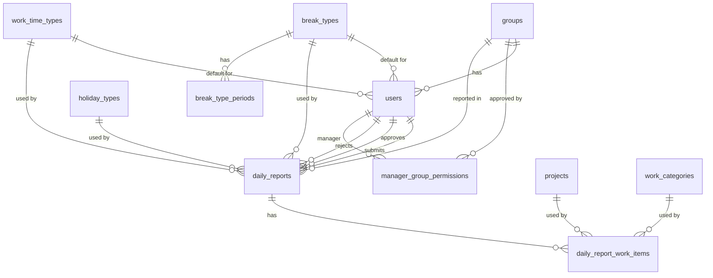

# サンプルアプリ DB概念設計

## 目的

社内向け日報管理システムのDB概念設計を定義する。

本資料は、Java / Spring Boot バックエンドのエンティティ設計、Repository設計、DBマイグレーション、テストデータ作成の入力情報として使用する。
画面、API、受入条件は以下を参照する。

- スコープ定義: `スコープ定義.md`
- 機能一覧・受入条件: `機能一覧・受入条件.md`
- 画面設計: `画面設計.md`
- API一覧: `API一覧.md`
- 状態遷移・業務フロー設計: `状態遷移・業務フロー設計.md`
- 入力チェック・業務ルール一覧: `入力チェック・業務ルール一覧.md`
- 非機能要件: `非機能要件.md`
- テスト設計書: `テスト設計書.md`

## 設計方針

- DBはOracle Databaseを想定する
- 初回サンプルでは、ユーザー、グループ、上長の承認対象グループ、案件、作業分類、休日区分、休憩区分、勤務区分は初期データとして用意する
- 初回サンプルでは、各種マスタのメンテナンス画面は作らない
- 日報は日報ヘッダと作業明細に分ける
- 時間量は分単位の整数で保持する
- 勤務開始・終了時刻は、日付とは分けて分単位で保持する
- 休憩時間は社員に紐づく休憩区分から自動算出して保持する
- 実勤務時間は社員に紐づく勤務区分から通常勤務時間、残業時間、深夜時間に分解して保持する
- 日時はタイムゾーンを考慮できる型で扱う
- 同一社員・同一日の日報は1件のみ登録できる
- 承認状態、ロールは列挙値として扱う
- 休日区分はマスタで管理し、日報には利用時点の休日区分IDを保持する
- 論理削除は初回サンプルでは扱わない

## エンティティ一覧

| エンティティ | 概要 |
| --- | --- |
| users | 利用者。社員、上長、管理者を表す |
| groups | 所属グループマスタ |
| manager_group_permissions | 上長が承認できるグループを表す |
| projects | 案件マスタ |
| work_categories | 作業分類マスタ |
| holiday_types | 休日区分マスタ |
| break_types | 休憩区分マスタ |
| break_type_periods | 休憩区分に紐づく休憩時間帯 |
| work_time_types | 勤務区分マスタ |
| daily_reports | 日報ヘッダ |
| daily_report_work_items | 日報作業明細 |

## ER概要

## users

### 概要

システム利用者を表す。
初回サンプルでは、社員、上長、管理者のいずれか1ロールのみを持つ。

### 主な属性

| 属性 | 内容 | 必須 | 備考 |
| --- | --- | --- | --- |
| user_id | ユーザーID | 必須 | 主キー |
| employee_id | 社員ID | 必須 | API、画面、CSVで使用する業務上の社員識別子 |
| login_id | ログインID | 必須 | 一意 |
| password_hash | パスワードハッシュ | 必須 | 平文パスワードは保持しない |
| user_name | ユーザー名 | 必須 | 画面表示、CSV出力に使用 |
| user_role | ロール | 必須 | `EMPLOYEE`、`MANAGER`、`ADMIN` |
| group_id | 所属グループID | 条件付き | groups への参照。社員は必須 |
| break_type_id | 休憩区分ID | 条件付き | break_types への参照。社員は必須 |
| work_time_type_id | 勤務区分ID | 条件付き | work_time_types への参照。社員は必須 |
| created_at | 作成日時 | 必須 | 監査用 |
| updated_at | 更新日時 | 必須 | 監査用 |

### 主な制約

- `employee_id` は一意
- `login_id` は一意
- `user_role` は定義済みロールのみ許可
- `EMPLOYEE` ロールのユーザーは `group_id`、`break_type_id`、`work_time_type_id` を必須とする

## groups

### 概要

所属グループマスタを表す。
社員の所属、上長の承認対象、検索条件、未承認一覧の絞り込みに使用する。

### 主な属性

| 属性 | 内容 | 必須 | 備考 |
| --- | --- | --- | --- |
| group_id | グループID | 必須 | 主キー |
| group_name | グループ名 | 必須 | 画面表示、CSV出力に使用 |
| display_order | 表示順 | 必須 | 選択肢表示に使用 |
| active_flag | 有効フラグ | 必須 | 初期データで使用 |
| created_at | 作成日時 | 必須 | 監査用 |
| updated_at | 更新日時 | 必須 | 監査用 |

### 主な制約

- `group_name` は一意

## manager_group_permissions

### 概要

上長が承認できるグループを表す。
上長の日報参照、承認、差戻し、未承認一覧の権限制御に使用する。

### 主な属性

| 属性 | 内容 | 必須 | 備考 |
| --- | --- | --- | --- |
| manager_group_permission_id | 上長グループ権限ID | 必須 | 主キー |
| manager_user_id | 上長ユーザーID | 必須 | users への参照 |
| group_id | 承認対象グループID | 必須 | groups への参照 |
| created_at | 作成日時 | 必須 | 監査用 |
| updated_at | 更新日時 | 必須 | 監査用 |

### 主な制約

- `manager_user_id` は `MANAGER` ロールのユーザーを参照する
- `manager_user_id` と `group_id` の組み合わせは一意
- 上長は、承認対象グループに所属する社員の日報のみ承認・差戻しできる
- 同一グループを複数の上長に紐づけられるため、同一社員の日報を複数の上長が承認可能なルートも表現できる

## projects

### 概要

案件マスタを表す。
日報作業明細、月次集計、CSV出力で使用する。

### 主な属性

| 属性 | 内容 | 必須 | 備考 |
| --- | --- | --- | --- |
| project_id | 案件ID | 必須 | 主キー |
| project_name | 案件名 | 必須 | 画面表示、CSV出力に使用 |
| display_order | 表示順 | 必須 | 選択肢表示に使用 |
| active_flag | 有効フラグ | 必須 | 初期データで使用 |
| created_at | 作成日時 | 必須 | 監査用 |
| updated_at | 更新日時 | 必須 | 監査用 |

### 主な制約

- `project_name` は一意
- 作業明細から参照されている案件は物理削除しない

## work_categories

### 概要

作業分類マスタを表す。
日報作業明細、月次集計、CSV出力で使用する。

### 主な属性

| 属性 | 内容 | 必須 | 備考 |
| --- | --- | --- | --- |
| work_category_id | 作業分類ID | 必須 | 主キー |
| work_category_name | 作業分類名 | 必須 | 画面表示、CSV出力に使用 |
| display_order | 表示順 | 必須 | 選択肢表示に使用 |
| active_flag | 有効フラグ | 必須 | 初期データで使用 |
| created_at | 作成日時 | 必須 | 監査用 |
| updated_at | 更新日時 | 必須 | 監査用 |

### 主な制約

- `work_category_name` は一意
- 作業明細から参照されている作業分類は物理削除しない

## holiday_types

### 概要

休日区分マスタを表す。
日報登録時の入力可否、勤務時刻・作業明細の要否、集計、CSV出力で使用する。

### 主な属性

| 属性 | 内容 | 必須 | 備考 |
| --- | --- | --- | --- |
| holiday_type_id | 休日区分ID | 必須 | 主キー |
| holiday_type_code | 休日区分コード | 必須 | `WORKDAY`、`HOLIDAY`、`PAID_LEAVE`、`AM_OFF`、`PM_OFF` |
| holiday_type_name | 休日区分名 | 必須 | 画面表示、CSV出力に使用 |
| requires_work_time | 勤務時刻必須フラグ | 必須 | 勤務開始・終了時刻が必要かを表す |
| allows_work_items | 作業明細許可フラグ | 必須 | 作業明細を登録できるかを表す |
| display_order | 表示順 | 必須 | 選択肢表示に使用 |
| active_flag | 有効フラグ | 必須 | 初期データで使用 |
| created_at | 作成日時 | 必須 | 監査用 |
| updated_at | 更新日時 | 必須 | 監査用 |

### 主な制約

- `holiday_type_code` は一意
- 有給休暇は勤務時刻と作業明細を許可しない
- 休日は作業あり、作業なしの両方を許可するため、画面・業務ルールで勤務時刻と作業明細の有無を判定する

## break_types

### 概要

休憩区分マスタを表す。
社員に紐づけ、勤務時間帯に含まれる休憩時間帯から日報の休憩時間を自動算出する。

### 主な属性

| 属性 | 内容 | 必須 | 備考 |
| --- | --- | --- | --- |
| break_type_id | 休憩区分ID | 必須 | 主キー |
| break_type_name | 休憩区分名 | 必須 | 例: 標準休憩、夕方休憩あり |
| display_order | 表示順 | 必須 | 選択肢表示に使用 |
| active_flag | 有効フラグ | 必須 | 初期データで使用 |
| created_at | 作成日時 | 必須 | 監査用 |
| updated_at | 更新日時 | 必須 | 監査用 |

### 主な制約

- `break_type_name` は一意
- 社員に設定されている休憩区分は、日報登録・編集時に自由変更しない

## break_type_periods

### 概要

休憩区分に紐づく休憩時間帯を表す。
1つの休憩区分に複数の休憩時間帯を持てる。

### 主な属性

| 属性 | 内容 | 必須 | 備考 |
| --- | --- | --- | --- |
| break_type_period_id | 休憩時間帯ID | 必須 | 主キー |
| break_type_id | 休憩区分ID | 必須 | break_types への参照 |
| start_time_minutes | 休憩開始時刻 | 必須 | 0:00からの経過分 |
| end_time_minutes | 休憩終了時刻 | 必須 | 0:00からの経過分 |
| display_order | 表示順 | 必須 | 表示・計算順 |
| created_at | 作成日時 | 必須 | 監査用 |
| updated_at | 更新日時 | 必須 | 監査用 |

### 主な制約

- `end_time_minutes` は `start_time_minutes` より後にする
- 同一休憩区分内の休憩時間帯は、初期データ作成時に重複しないようにする

## work_time_types

### 概要

勤務区分マスタを表す。
社員に紐づけ、実勤務時間を通常勤務時間、残業時間、深夜時間へ分解するために使用する。

### 主な属性

| 属性 | 内容 | 必須 | 備考 |
| --- | --- | --- | --- |
| work_time_type_id | 勤務区分ID | 必須 | 主キー |
| work_time_type_name | 勤務区分名 | 必須 | 例: 勤務区分A、勤務区分B |
| regular_start_time_minutes | 通常勤務開始時刻 | 必須 | 0:00からの経過分 |
| regular_end_time_minutes | 通常勤務終了時刻 | 必須 | 0:00からの経過分 |
| display_order | 表示順 | 必須 | 選択肢表示に使用 |
| active_flag | 有効フラグ | 必須 | 初期データで使用 |
| created_at | 作成日時 | 必須 | 監査用 |
| updated_at | 更新日時 | 必須 | 監査用 |

### 主な制約

- `work_time_type_name` は一意
- `regular_end_time_minutes` は `regular_start_time_minutes` より後にする
- 初回サンプルでは深夜時間帯を全勤務区分共通で `22:00-05:00` として扱う
- 社員に設定されている勤務区分は、日報登録・編集時に自由変更しない

## daily_reports

### 概要

日報ヘッダを表す。
日付、休日区分、実勤務時間、勤務時間内訳、承認状態、承認・差戻しの監査情報を保持する。

### 主な属性

| 属性 | 内容 | 必須 | 備考 |
| --- | --- | --- | --- |
| report_id | 日報ID | 必須 | 主キー |
| employee_user_id | 社員ユーザーID | 必須 | users への参照 |
| group_id | 所属グループID | 必須 | groups への参照。登録時点の所属グループを保持 |
| report_date | 日付 | 必須 | 同一社員・同一日で一意 |
| holiday_type_id | 休日区分ID | 必須 | holiday_types への参照 |
| break_type_id | 休憩区分ID | 条件付き | break_types への参照。勤務時刻がある日報で保持 |
| work_time_type_id | 勤務区分ID | 条件付き | work_time_types への参照。勤務時刻がある日報で保持 |
| start_time_minutes | 勤務開始時刻 | 条件付き | 0:00からの経過分。休日区分により必須可否が変わる |
| end_time_minutes | 勤務終了時刻 | 条件付き | 0:00からの経過分。休日区分により必須可否が変わる |
| break_minutes | 休憩時間 | 条件付き | 分単位。休憩区分から自動算出した値 |
| work_minutes | 実勤務時間 | 条件付き | 分単位。勤務時刻と自動算出休憩時間から算出した値 |
| regular_work_minutes | 通常勤務時間 | 条件付き | 分単位。勤務区分から算出した値 |
| overtime_work_minutes | 残業時間 | 条件付き | 分単位。勤務区分から算出した値 |
| night_work_minutes | 深夜時間 | 条件付き | 分単位。勤務区分と深夜時間帯から算出した値 |
| remarks | 備考 | 任意 | CSV出力対象 |
| approval_status | 承認状態 | 必須 | `DRAFT`、`PENDING`、`REJECTED`、`APPROVED` |
| submitted_at | 提出日時 | 条件付き | 提出・再提出時に更新 |
| approver_user_id | 承認者ユーザーID | 条件付き | users への参照 |
| approved_at | 承認日時 | 条件付き | 承認時に設定 |
| rejector_user_id | 差戻し者ユーザーID | 条件付き | users への参照 |
| rejected_at | 差戻し日時 | 条件付き | 差戻し時に設定 |
| reject_comment | 最新差戻しコメント | 条件付き | 差戻し時に必須 |
| created_at | 作成日時 | 必須 | 監査用 |
| updated_at | 更新日時 | 必須 | 監査用 |

### 主な制約

- `employee_user_id` と `report_date` の組み合わせは一意
- `employee_user_id` は `EMPLOYEE` ロールのユーザーを参照する
- `group_id` は日報登録者の登録時点の所属グループを保持する
- `approval_status` は定義済み承認状態のみ許可
- `holiday_type_id` は有効な休日区分マスタを参照する
- `work_minutes` は0以上
- `break_minutes` は0以上
- 勤務時刻がある日報では、`end_time_minutes` は `start_time_minutes` より後にする
- 勤務時刻がある日報では、休憩区分から算出した `break_minutes` は勤務開始から勤務終了までの時間未満にする
- 勤務時刻がある日報では、`work_time_type_id` を必須とする
- `regular_work_minutes`、`overtime_work_minutes`、`night_work_minutes` は重複しない内訳として算出し、合計が `work_minutes` と一致する必要がある
- 有給休暇の日報では、`start_time_minutes`、`end_time_minutes`、`break_type_id`、`work_time_type_id`、`break_minutes`、`work_minutes`、`regular_work_minutes`、`overtime_work_minutes`、`night_work_minutes` を保持しない
- 作業なしの休日では、`start_time_minutes`、`end_time_minutes`、`break_type_id`、`work_time_type_id`、`break_minutes`、`work_minutes`、`regular_work_minutes`、`overtime_work_minutes`、`night_work_minutes` を保持しない

### 状態別の監査項目

| 承認状態 | submitted_at | approver_user_id / approved_at | rejector_user_id / rejected_at / reject_comment |
| --- | --- | --- | --- |
| DRAFT | 空 | 空 | 空 |
| PENDING | 設定 | 空 | 差戻し後の再提出では最新差戻し情報を保持 |
| REJECTED | 設定 | 空 | 設定 |
| APPROVED | 設定 | 設定 | 差戻し後の再提出・承認では最新差戻し情報を保持 |

## daily_report_work_items

### 概要

日報の案件別・作業分類別の作業明細を表す。
1日の日報に複数件登録できる。

### 主な属性

| 属性 | 内容 | 必須 | 備考 |
| --- | --- | --- | --- |
| work_item_id | 作業明細ID | 必須 | 主キー |
| report_id | 日報ID | 必須 | daily_reports への参照 |
| project_id | 案件ID | 必須 | projects への参照 |
| work_category_id | 作業分類ID | 必須 | work_categories への参照 |
| work_minutes | 作業時間 | 必須 | 分単位 |
| display_order | 表示順 | 必須 | 画面表示順 |
| created_at | 作成日時 | 必須 | 監査用 |
| updated_at | 更新日時 | 必須 | 監査用 |

### 主な制約

- `work_minutes` は1以上
- 同一日報内の作業明細は `display_order` の昇順で表示する
- 作業明細の合計時間は、実勤務時間がある日報の `work_minutes` と一致する必要がある
- 有給休暇の日報には作業明細を登録しない
- 作業なしの休日には作業明細を登録しない

## 列挙値

### user_role

| 値 | 内容 |
| --- | --- |
| EMPLOYEE | 社員 |
| MANAGER | 上長 |
| ADMIN | 管理者 |

### approval_status

| 値 | 内容 |
| --- | --- |
| DRAFT | 未提出 |
| PENDING | 承認待ち |
| REJECTED | 差戻し |
| APPROVED | 承認済み |

### holiday_type 初期データ

休日区分は `holiday_types` の初期データとして登録する。

| holiday_type_code | 内容 |
| --- | --- |
| WORKDAY | 通常勤務 |
| HOLIDAY | 休日 |
| PAID_LEAVE | 有給休暇 |
| AM_OFF | 午前休 |
| PM_OFF | 午後休 |

## 主要な一意制約

| 対象 | 制約 |
| --- | --- |
| users | employee_id |
| users | login_id |
| groups | group_name |
| manager_group_permissions | manager_user_id + group_id |
| projects | project_name |
| work_categories | work_category_name |
| holiday_types | holiday_type_code |
| break_types | break_type_name |
| work_time_types | work_time_type_name |
| daily_reports | employee_user_id + report_date |

## 主要な参照関係

| 参照元 | 参照先 | 内容 |
| --- | --- | --- |
| users.group_id | groups.group_id | 所属グループ |
| users.break_type_id | break_types.break_type_id | 社員の休憩区分 |
| users.work_time_type_id | work_time_types.work_time_type_id | 社員の勤務区分 |
| manager_group_permissions.manager_user_id | users.user_id | 上長 |
| manager_group_permissions.group_id | groups.group_id | 承認対象グループ |
| daily_reports.employee_user_id | users.user_id | 日報登録者 |
| daily_reports.group_id | groups.group_id | 日報登録時点の所属グループ |
| daily_reports.holiday_type_id | holiday_types.holiday_type_id | 休日区分 |
| daily_reports.break_type_id | break_types.break_type_id | 登録時点の休憩区分 |
| daily_reports.work_time_type_id | work_time_types.work_time_type_id | 登録時点の勤務区分 |
| daily_reports.approver_user_id | users.user_id | 承認者 |
| daily_reports.rejector_user_id | users.user_id | 差戻し者 |
| break_type_periods.break_type_id | break_types.break_type_id | 休憩区分 |
| daily_report_work_items.report_id | daily_reports.report_id | 日報ヘッダ |
| daily_report_work_items.project_id | projects.project_id | 案件 |
| daily_report_work_items.work_category_id | work_categories.work_category_id | 作業分類 |

## 検索・集計で利用する主な項目

| 用途 | 主な項目 |
| --- | --- |
| 日報カレンダー・一覧 | report_date、employee_user_id、group_id、approval_status、holiday_type_id |
| 未承認一覧 | approval_status、group_id、employee_user_id |
| 月次集計 | report_date、approval_status、employee_user_id、group_id、project_id、work_category_id、holiday_type_id、regular_work_minutes、overtime_work_minutes、night_work_minutes |
| CSV出力 | report_date、approval_status、employee_user_id、group_id、project_id、work_category_id、holiday_type_id、regular_work_minutes、overtime_work_minutes、night_work_minutes |

## Oracle利用時の物理設計方針

| 対象 | 方針 |
| --- | --- |
| ID採番 | Oracleの identity column を基本とする。利用できないバージョンの場合は sequence を使用する |
| 文字列 | `VARCHAR2` を基本とし、桁数は物理設計時に確定する |
| 日付 | 業務日付は `DATE` を基本とし、時刻部分は業務上使用しない |
| 時刻 | `start_time_minutes`、`end_time_minutes` は0:00からの経過分として `NUMBER(4)` で保持する。アプリケーションでは `HH:mm` として扱う |
| 日時 | 作成日時、更新日時、提出日時、承認日時、差戻し日時は `TIMESTAMP WITH LOCAL TIME ZONE` を基本候補とする |
| 真偽値 | Oracle Databaseには汎用的なテーブル列の `BOOLEAN` を前提にしない。`active_flag` などのフラグ列は `CHAR(1)` または `NUMBER(1)` で保持する |
| 列挙値 | `user_role`、`approval_status` は文字列で保持し、アプリケーション層とDB制約の両方で妥当性を確認する。休日区分は `holiday_types` を参照する |
| 予約語回避 | Oracleの予約語や一般的なキーワードに近い列名は避ける。例: `role` ではなく `user_role` を使用する |

## DB設計上の補足

- 日報の状態遷移はDB制約だけでなく、アプリケーション層で検証する
- 休日区分ごとの入力可否は、アプリケーション層で検証する
- 休憩時間は、社員に紐づく休憩区分の休憩時間帯と勤務時間帯の重なりからアプリケーション層で自動算出する
- 通常勤務時間、残業時間、深夜時間は、社員に紐づく勤務区分と勤務時間帯からアプリケーション層で自動算出する
- 作業明細合計と実勤務時間の一致は、アプリケーション層で検証する
- 上長の参照、承認、差戻し権限は、日報の `group_id` と `manager_group_permissions` で判定する
- 画面・APIの `HH:mm` とDBの分整数の変換は、アプリケーション層で行う
- 作業なしの休日・有給休暇でDBに勤務時刻、休憩時間、実勤務時間、勤務時間内訳、作業明細を保持しない場合でも、CSV出力時は `スコープ定義.md` のCSV出力仕様に従い、該当列を空欄または0分として出力する
- 月次集計は集計テーブルを持たず、承認済み日報と作業明細から都度集計する
- 初回サンプルでは履歴テーブルを持たず、最新の差戻しコメントのみ保持する
