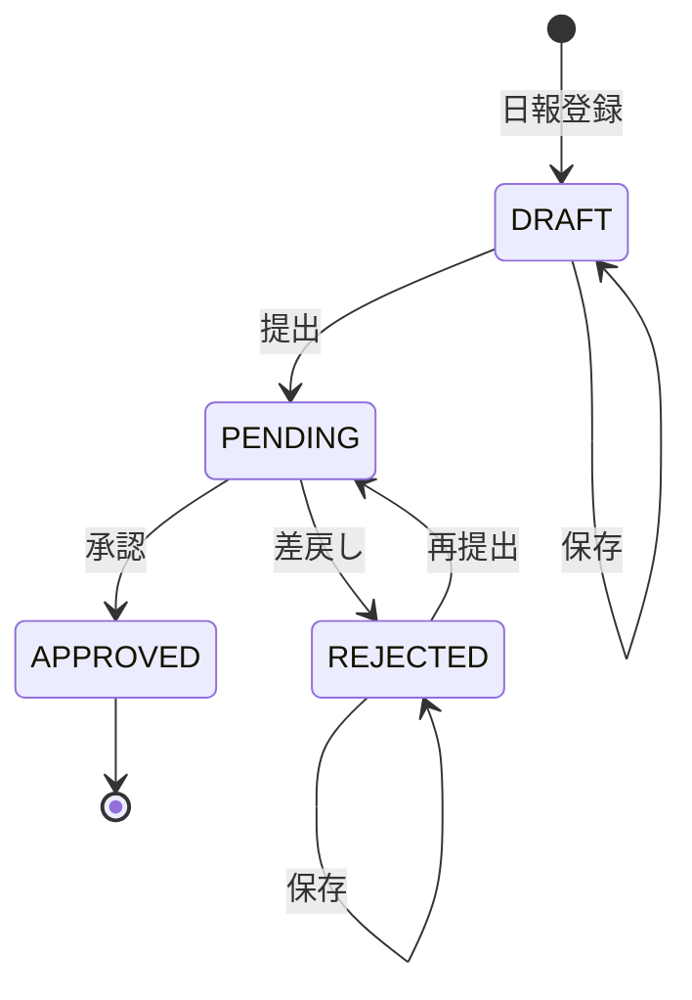

# サンプルアプリ 状態遷移・業務フロー設計

## 目的

社内向け日報管理システムにおける、日報の承認状態、状態遷移、ロール別操作可否、業務フローを定義する。

本資料は、Java / Spring Boot バックエンドの状態変更処理、React + TypeScript フロントエンドの操作制御、API確認、画面確認、E2E相当確認の入力情報として使用する。
関連資料は以下を参照する。

- スコープ定義: `スコープ定義.md`
- 機能一覧・受入条件: `機能一覧・受入条件.md`
- 画面設計: `画面設計.md`
- API一覧: `API一覧.md`
- DB概念設計: `DB概念設計.md`
- 入力チェック・業務ルール一覧: `入力チェック・業務ルール一覧.md`
- 非機能要件: `非機能要件.md`
- テスト設計書: `テスト設計書.md`

## 前提

- 初回サンプルでは、利用者は社員、上長、管理者のいずれか1ロールのみを持つ
- 社員は自分の日報のみ登録、編集、提出、再提出できる
- 上長は承認対象グループの日報のみ参照、承認、差戻しできる
- 管理者は月次集計とCSV出力を行うが、日報の登録、編集、提出、再提出、承認、差戻しは行わない
- 上長の承認対象は `manager_group_permissions` で判定する
- 状態変更APIでは、現在の承認状態、利用者ロール、対象日報への権限をバックエンドで必ず検証する

## 承認状態

| 状態 | API値 | 内容 | 主な操作主体 |
| --- | --- | --- | --- |
| 未提出 | `DRAFT` | 社員が作成または保存したが、上長承認に回していない状態 | 社員 |
| 承認待ち | `PENDING` | 社員が提出または再提出し、上長の判断待ちになっている状態 | 上長 |
| 差戻し | `REJECTED` | 上長がコメント付きで差戻し、社員の修正待ちになっている状態 | 社員 |
| 承認済み | `APPROVED` | 上長が承認し、月次集計とCSV出力の対象になる状態 | 管理者 |

## 状態遷移図

## 状態遷移一覧

| No | 操作 | API | 操作ロール | 遷移前 | 遷移後 | 主な条件 |
| --- | --- | --- | --- | --- | --- | --- |
| T-001 | 日報登録 | `POST /api/daily-reports` | 社員 | なし | `DRAFT` | 同一社員・同一日の日報が存在しない |
| T-002 | 未提出日報保存 | `PUT /api/daily-reports/{reportId}` | 社員 | `DRAFT` | `DRAFT` | 自分の日報である |
| T-003 | 日報提出 | `POST /api/daily-reports/{reportId}/submit` | 社員 | `DRAFT` | `PENDING` | 自分の日報であり、入力チェックを満たす |
| T-004 | 日報承認 | `POST /api/daily-reports/{reportId}/approve` | 上長 | `PENDING` | `APPROVED` | 承認対象グループの日報である |
| T-005 | 日報差戻し | `POST /api/daily-reports/{reportId}/reject` | 上長 | `PENDING` | `REJECTED` | 承認対象グループの日報であり、差戻しコメントが入力されている |
| T-006 | 差戻し日報保存 | `PUT /api/daily-reports/{reportId}` | 社員 | `REJECTED` | `REJECTED` | 自分の日報である |
| T-007 | 日報再提出 | `POST /api/daily-reports/{reportId}/resubmit` | 社員 | `REJECTED` | `PENDING` | 自分の日報であり、入力チェックを満たす |

## ロール・状態別操作可否

| 操作 | 未提出 `DRAFT` | 承認待ち `PENDING` | 差戻し `REJECTED` | 承認済み `APPROVED` |
| --- | --- | --- | --- | --- |
| 社員: 自分の日報参照 | 可 | 可 | 可 | 可 |
| 社員: 自分の日報編集 | 可 | 不可 | 可 | 不可 |
| 社員: 提出 | 可 | 不可 | 不可 | 不可 |
| 社員: 再提出 | 不可 | 不可 | 可 | 不可 |
| 上長: 承認対象グループの日報参照 | 可 | 可 | 可 | 可 |
| 上長: 承認 | 不可 | 可 | 不可 | 不可 |
| 上長: 差戻し | 不可 | 可 | 不可 | 不可 |
| 上長: 未承認一覧表示対象 | 不可 | 可 | 不可 | 不可 |
| 管理者: 月次集計対象 | 不可 | 不可 | 不可 | 可 |
| 管理者: CSV出力対象 | 不可 | 不可 | 不可 | 可 |

## 状態別の画面制御

| 状態 | 日報一覧 | 日報詳細 | 日報編集 | 未承認一覧 |
| --- | --- | --- | --- | --- |
| `DRAFT` | 社員、管理者に表示する。上長は承認対象グループの日報として表示できる | 社員、上長、管理者が権限範囲で参照できる | 社員本人のみ利用できる | 表示しない |
| `PENDING` | 社員、上長、管理者が権限範囲で表示できる | 上長には承認、差戻し操作を表示する | 利用できない | 上長に表示する |
| `REJECTED` | 社員、上長、管理者が権限範囲で表示できる | 最新差戻しコメントを表示する | 社員本人のみ利用できる | 表示しない |
| `APPROVED` | 社員、上長、管理者が権限範囲で表示できる | 参照のみ可能とする | 利用できない | 表示しない |

## 状態変更時の更新項目

| 操作 | approval_status | submitted_at | approver_user_id | approved_at | rejector_user_id | rejected_at | reject_comment |
| --- | --- | --- | --- | --- | --- | --- | --- |
| 日報登録 | `DRAFT` | 空 | 空 | 空 | 空 | 空 | 空 |
| 未提出日報保存 | 変更しない | 変更しない | 空 | 空 | 空 | 空 | 空 |
| 日報提出 | `PENDING` | 現在日時を設定 | 空 | 空 | 空 | 空 | 空 |
| 日報承認 | `APPROVED` | 変更しない | 承認者を設定 | 現在日時を設定 | 変更しない | 変更しない | 変更しない |
| 日報差戻し | `REJECTED` | 変更しない | 空 | 空 | 差戻し者を設定 | 現在日時を設定 | 入力値を設定 |
| 差戻し日報保存 | 変更しない | 変更しない | 空 | 空 | 変更しない | 変更しない | 変更しない |
| 日報再提出 | `PENDING` | 現在日時で更新 | 空 | 空 | 変更しない | 変更しない | 変更しない |

## 正常業務フロー

### 日報提出から承認まで

| No | 操作主体 | 操作 | 期待結果 |
| --- | --- | --- | --- |
| 1 | 社員 | 日報カレンダー・一覧画面から対象日付を選択し、日報登録画面で休日区分、勤務時刻、作業明細、備考を入力する | 休憩時間と勤務時間が自動算出され、日報が `DRAFT` で保存される |
| 2 | 社員 | 日報を提出する | 入力チェック後、状態が `PENDING` になる |
| 3 | 上長 | 未承認一覧を表示する | 承認対象グループの `PENDING` 日報が表示される |
| 4 | 上長 | 日報詳細を確認する | 日報内容と作業明細を確認できる |
| 5 | 上長 | 承認する | 状態が `APPROVED` になり、承認者と承認日時が記録される |
| 6 | 管理者 | 月次集計またはCSV出力を行う | 承認済み日報のみ対象になる |

### 差戻しから再提出まで

| No | 操作主体 | 操作 | 期待結果 |
| --- | --- | --- | --- |
| 1 | 社員 | 日報を提出する | 状態が `PENDING` になる |
| 2 | 上長 | 日報詳細を確認し、差戻しコメントを入力する | 差戻し可能な状態になる |
| 3 | 上長 | 差戻しを確定する | 状態が `REJECTED` になり、差戻し者、差戻し日時、最新差戻しコメントが記録される |
| 4 | 社員 | 差戻しコメントを確認する | 修正理由を確認できる |
| 5 | 社員 | 日報を修正して保存する | 状態は `REJECTED` のまま保持される |
| 6 | 社員 | 再提出する | 入力チェック後、状態が `PENDING` になり、提出日時が更新される |
| 7 | 上長 | 再提出された日報を承認または差戻しする | `APPROVED` または `REJECTED` に遷移する |

## 異常系・排他観点

| 観点 | 条件 | 期待結果 | 主なHTTPステータス |
| --- | --- | --- | --- |
| 未認証 | ログインしていない利用者が状態変更APIを呼び出す | 処理しない | 401 |
| 権限なし | 社員が他社員の日報を提出または再提出する | 処理しない | 403 |
| 権限なし | 上長が承認対象グループ以外の日報を承認または差戻しする | 処理しない | 403 |
| 権限なし | 管理者が承認または差戻しする | 処理しない | 403 |
| 対象なし | 指定した日報IDが存在しない | 処理しない | 404 |
| 状態不整合 | `PENDING` 以外の日報を承認する | 処理しない | 409 |
| 状態不整合 | `PENDING` 以外の日報を差戻しする | 処理しない | 409 |
| 状態不整合 | `DRAFT` 以外の日報を提出する | 処理しない | 409 |
| 状態不整合 | `REJECTED` 以外の日報を再提出する | 処理しない | 409 |
| 入力不備 | 提出または再提出時に日報入力チェックに違反する | 処理しない | 400 |
| 入力不備 | 差戻しコメントが未入力で差戻しする | 処理しない | 400 |
| 重複操作 | 既に承認された日報に対して、古い画面から差戻しする | 処理しない | 409 |

## E2E相当確認対象

| 確認ID | 業務フロー | 対象機能 |
| --- | --- | --- |
| E2E-001 | 日報登録、提出、上長承認、管理者集計 | F-002、F-006、F-007、F-011 |
| E2E-002 | 日報登録、提出、上長差戻し、社員修正、再提出 | F-002、F-006、F-008、F-009 |
| E2E-003 | 承認済み日報のCSV出力 | F-002、F-006、F-007、F-012 |
| E2E-004 | 権限外利用者による状態変更不可 | F-006、F-007、F-008、F-009 |
| E2E-005 | 状態不整合時の状態変更不可 | F-006、F-007、F-008、F-009 |

## 実装時の注意事項

- フロントエンドのボタン表示制御だけでなく、バックエンドAPIで同じ条件を必ず検証する
- 状態変更APIは、状態更新と監査項目更新を同一トランザクションで処理する
- 提出、再提出時は日報登録と同じ入力チェックを実行する
- 承認済み日報は更新不可とし、初回サンプルでは承認取消は扱わない
- 差戻しコメントは最新のみ保持し、履歴管理は初回サンプルでは扱わない
- 同時操作による状態不整合は、状態更新前の再チェックで検出する
